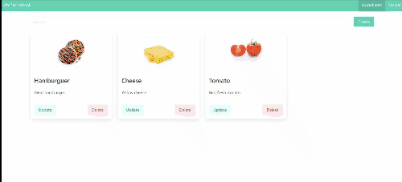
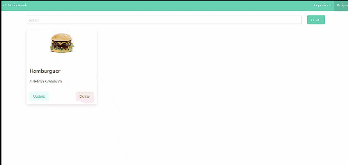

# vite-recipe-book

Recipe book made with Vite, Vue3, VueRouter4 and Bulma.

Vue3 Composition API is being used for state management.

You can add, update and remove ingredients or recipes.

## Preview images

